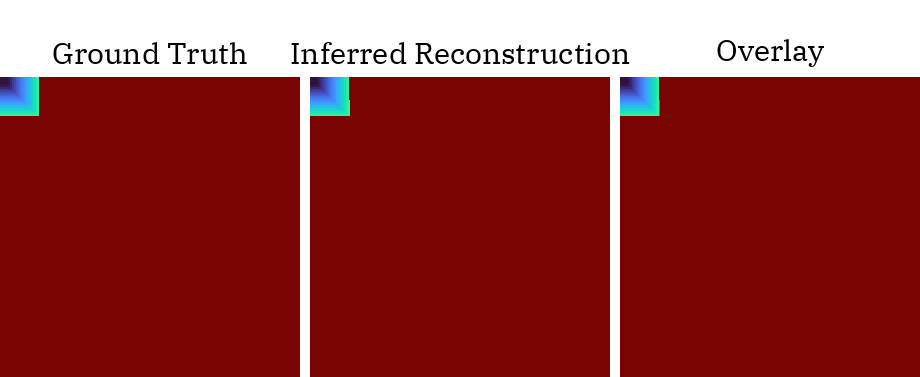

# Bayes3D


## Setup

```
git submodule update --init --recursive
conda create -n bayes3d python=3.9
conda activate bayes3d
pip install -r requirements.txt
pip install -e .
```

(optionally install genjax)
```
pip install -r assets/genjax/requirements.txt
pip install -e assets/genjax
```

Install JAX:
```
pip uninstall jax jaxlib
pip install jax==0.4.7 https://storage.googleapis.com/jax-releases/cuda11/jaxlib-0.4.7+cuda11.cudnn86-cp39-cp39-manylinux2014_x86_64.whl
```
(see https://storage.googleapis.com/jax-releases/jax_cuda_releases.html)


Download assets:
```
bash scripts/download.sh
```

## Test

To test successful setup run:
```
python demo.py
```
and view `demo.gif`


